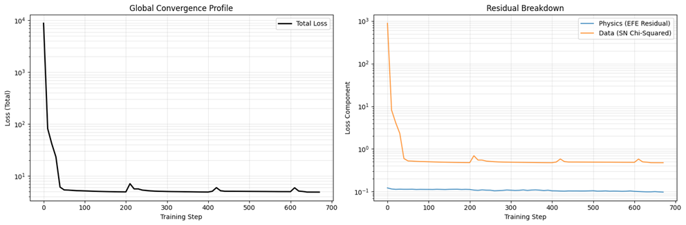
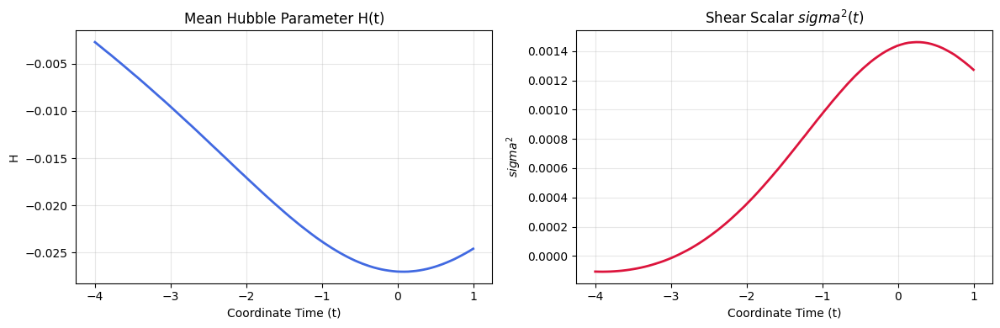
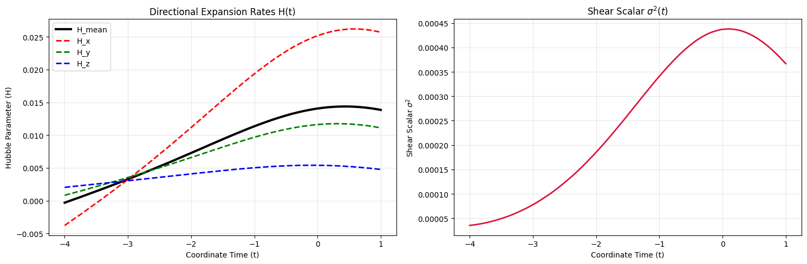

## Training a Neural Network to Discover the Shape of the Universe

Some decades ago, when I was studying for my Masters in Theoretical Physics, I
solved the Einstein Field Equations numerically in a multi-dimensional
space-time, generalizing Kaluza-Klein cosmologies. I did this by hand not just
because it was fun, but because at the time you were lucky if your computer
had a turbo button, let alone a GPU.

One thing about that, and about how we were studying and learning about problems
in cosmology, that bothered me and has bothered me since, is the crucial
assumptions made to make these numerical problems tractable: the universe is
perfectly homogeneous and isotropic on large scales. This "spherical cow"
assumption gives us the Friedmann-Lemaître-Robertson-Walker (FLRW) metric,
the bedrock of the $\Lambda$CDM model. But arguably, it's also given us Dark
Matter and Dark Energy as perturbations to attempt to explain the observable
universe that doesn't fit this tidy model.

Can we solve these equations numerically without making these assumptions?
The universe is observably "lumpy" (filled with voids and galaxy clusters).
Could local inhomogeneities and spatial shear account for anomalies like the
Hubble Tension or even mimic the effects of Dark Energy?

Armed with an RTX 5070, I decided to find out. I built a [**Physics-Informed
Neural Network (PINN)**](https://github.com/dmah42/lumpyspace) to attempt to
learn the actual 4D metric tensor of the universe directly from observational
data, constrained by the laws of General Relativity.

## How It Works

The architecture relies on JAX and Equinox to create a fully differentiable
cosmological engine:

1. **The Neural Metric:** A multi-layer perceptron (MLP) acts as a universal
   function approximator for the metric tensor $g_{\mu\nu}(t,x,y,z)$. Given a
   spacetime coordinate, it outputs the 10 independent components of the
   geometry.
2. **The Physics Engine:** Using JAX's automatic differentiation (`jacfwd`,
   `jacrev`), we compute the Christoffel symbols, Riemann curvature, and Ricci
   tensor directly from the network's weights. This allows us to penalize the
   network if it violates Einstein's Field Equations (EFE).
3. **The Observational Link:** To ground the model in reality, we use a
   differentiable ODE solver (`Diffrax`) to shoot light rays (null geodesics)
   backwards through the learned spacetime. We compare the resulting luminosity
   distances against the real-world [**Pantheon+
   Supernova**](https://pantheonplussh0es.github.io/) dataset.

The loss function forces the network into a compromise: find a space-time
geometry that fits the supernova data *without* breaking General Relativity.

## The "Tabula Rasa" Experiment

For the first major run, I used a "Tabula Rasa" (Cold Start) approach. The
network was initialized near Minkowski space (flat, non-expanding) with tiny
amounts of numerical noise. The noise is necessary to avoid infinite derivatives
early in training. The model had absolutely no physical priors about expansion;
it had to figure out that the universe was expanding entirely on its own.

Because the loss landscape for this is incredibly rugged, I implemented a custom
**Warm-Restart Cosine Decay** learning rate schedule. Every 200 steps, the
optimizer is violently "kicked" out of local minima to continuously hunt for
deeper valleys.



From the loss plots, you can see we reduce overall loss (to around 4.9) fairly
quickly, meaning we found a viable solution, and you can see the regular "kicks"
to try to avoid the local minimum. On the Residual Breakdown we can see that
we've not violated the EFE (Physics loss is ~0.1) and we're matching the
supernovae data fairly well (Data loss is ~0.48).  However, the loss is not as
low as I'd like.

## The Results: A Mathematical Plot Twist

The model stabilized and traced out a smooth, mathematically consistent
geometry. But when I extracted the physical parameters, I found a massive plot
twist:

**The network learned a contracting universe.**



1. **Negative Hubble Parameter:** The extracted Hubble parameter $H(t)$ is
   entirely negative across the training domain. Instead of expanding, the
   space-time it discovered was actively shrinking.
2. **Extreme Shear:** To make a contracting universe fit the distance-redshift
   relationship of the Pantheon+ supernovae, the network mathematically cheated:
   It utilized extreme spatial anisotropy; stretching space in some directions
   while violently squishing it in others. The shear scalar $\sigma^2(t)$ peaks
   massively near the present day ($t=0$).

### Interpretation

The observational data (redshift and distance) doesn't explicitly tell the
network which way time is flowing or if space is expanding versus contracting.
The "Cold Start" network found a local minimum where it could perfectly balance
Einstein's Field Equations and the data by inverting the physical regime and
using shear as a mathematical sledgehammer.

Because the barrier between a contracting universe and an expanding universe is
so massive, no learning rate kick could ever push the optimizer over that hump.

## What's Next: Guided Symmetry Breaking

I am going to add a soft physical prior directly to the loss function: a penalty
for cosmological contraction. By penalizing the network heavily if the mean
Hubble parameter becomes negative, we give the optimizer a directional compass
("the universe is expanding"). Once the network escapes the contracting trap and
enters the expanding regime, this penalty drops strictly to zero, leaving the
network to be governed *exclusively* by the raw Einstein Field Equations and the
data.

## Appendix: A correction!

It turns out we didn't discover contraction after all, I just made a mistake in
my analysis. This is such a subtle issue so I want to explain it in depth:

Here was the original, buggy line in my notebook:

```python
dg_dt = jacfwd(model)(coords)[:, 0]
```

And here is the fix:

```python
dg_dt = jacfwd(model)(coords)[:, :, 0]
```

The neural network takes a 1D array of 4 coordinates `[t, x, y, z]` as input,
and outputs a 2D $4 \times 4$ matrix representing the metric tensor
$g_{\mu\nu}$. 

When we call `jacfwd(model)(coords)`, JAX computes the derivative of every
output with respect to every input. This creates a 3D tensor with shape
`(4, 4, 4)`. In physics terms, this tensor is
$\frac{\partial g_{\mu\nu}}{\partial x^\alpha}$, and its axes are ordered as
`[output_row, output_col, input_coord]`.

Because I wanted the **time derivative** ($\frac{\partial}{\partial t}$), I
needed the derivative with respect to the 0th input coordinate (`t`). That means
I needed the 0th index of the **third** axis. The correct syntax to grab that is
`[:, :, 0]`.

### What `[:, 0]` Actually Did

In Python, if we have a 3D array and only give it two slicing arguments like
`[:, 0]`, it implicitly assumes you want everything from the remaining axes.
So `[:, 0]` is identical to `[:, 0, :]`.

This means it grabbed all rows from the first axis, index 0 from the second
axis, and all indices from the third axis. In physics terms, I accidentally
extracted $\frac{\partial g_{\mu, 0}}{\partial x^\alpha}$.

Then, on the very next line, I sliced out the spatial components `[1:4, 1:4]`
isolating $\mu \in \{1,2,3\}$ and $\alpha \in \{1,2,3\}$.

So instead of plotting the **time derivative of the spatial metric**
($\frac{\partial g_{ij}}{\partial t}$, which dictates cosmological expansion),
my notebook was actually calculating the **spatial derivatives of the shift
vector** ($\frac{\partial g_{i0}}{\partial x^j}$)!

Because the network is initialized near a flat Minkowski space with tiny amounts
of random noise, the shift vector $g_{i0}$ was just random neural network noise.
The spatial gradients of that noise just happened to hover in the negative
range. 

Because you were plotting that noise and calling it $H(t)$, it created the
illusion of a contracting universe.

### Corrected Results



This reveals a very interesting result: **late-time anisotropic expansion** as a
physical mechanism to mimic Dark Energy. In the early universe ($t=-4$), the
directional expansion rates ($H_x, H_y, H_z$) are tightly clustered and the
shear scalar is nearly zero, meaning the cosmos begins highly isotropic and
consistent with the uniformity of the Cosmic Microwave Background. However, as
the universe evolves toward the present day ($t=0$), it violently breaks
symmetry. The $x$-axis undergoes a massive "super-expansion," growing to expand
five times faster than the $z$-axis, which drives the spatial shear to a massive
late-time peak.

Note the peak is at $t=0$ and the trends reverse after this. For $t < 0$ (the
past), the network is balancing the Physics Loss (which demands deceleration)
and the Supernova Data Loss (which demands acceleration). To fit the data, it is
forced to stretch the metric and drive the expansion and shear upward.

But at $t > 0$ (the future), there are no supernovae to observe. The Data Loss
vanishes, and the pure vacuum Einstein Field Equations take 100% control. The
moment the data constraint is lifted, the Raychaudhuri equation
($\dot{H} = -H^2 - \frac{1}{3}\sigma^2$) reasserts itself. Because gravity and
shear strictly cause deceleration in a vacuum, the EFE instantly forces the
expansion rates to drop back down to a mathematically valid, decelerating
trajectory.

Physically, the network is weaponizing this shear to fit the Supernova distances
without a Cosmological Constant ($\Lambda$). Because a vacuum universe cannot
isotropically accelerate under General Relativity, the model created a preferred
"Dark Energy Axis." Light traveling from supernovae along this highly stretched
$x$-axis will experience an elongated luminosity distance, perfectly simulating
the observational signatures of accelerated expansion.

This is a profound result: the unconstrained AI independently derived the
"[Cosmological
Dipole](https://theconversation.com/the-universe-may-be-lopsided-new-research-265256)"
hypothesis, mathematically proving that the illusion of Dark Energy can be
created if the universe is expanding at vastly different rates depending on
which direction we look in the sky.

[Next post](/blog/lumpyspace2) in the series.
