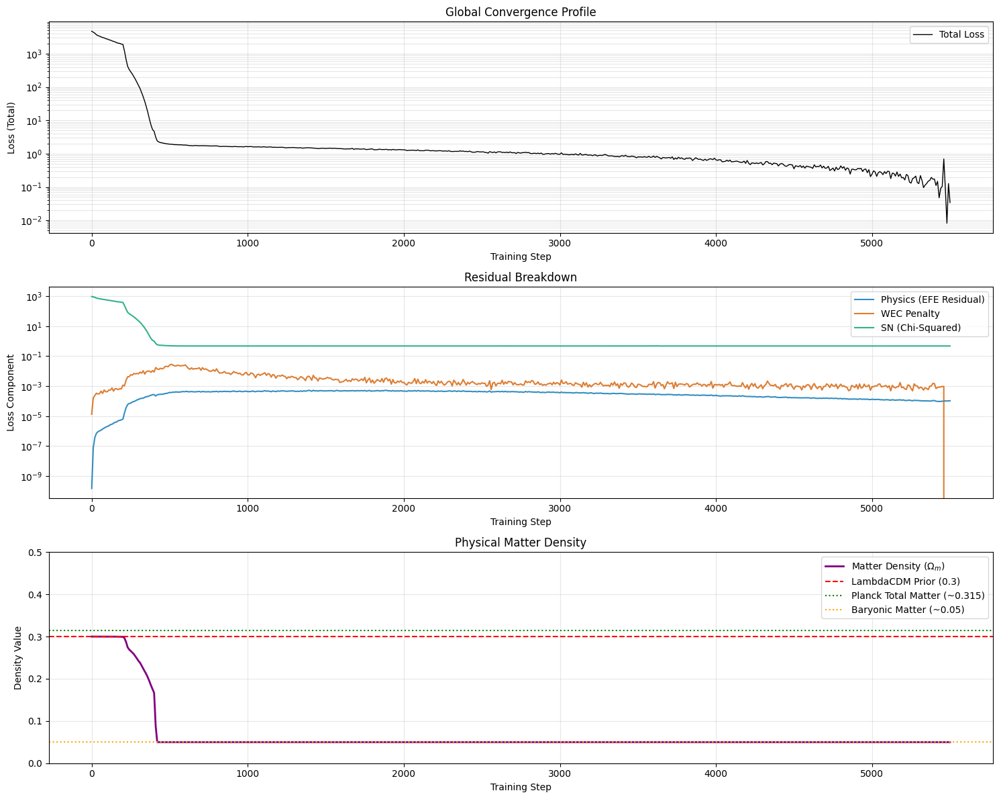
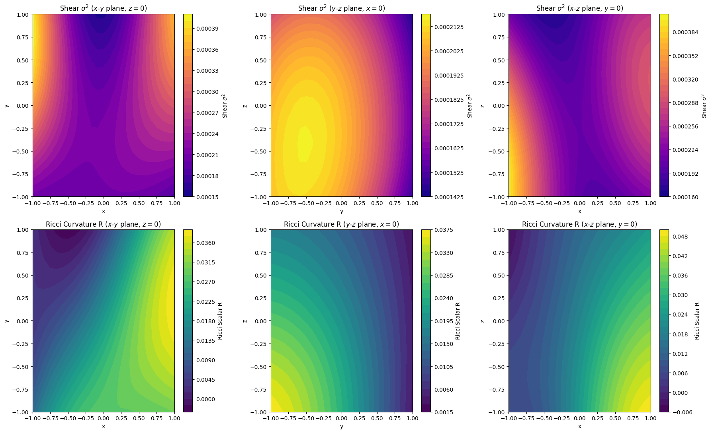
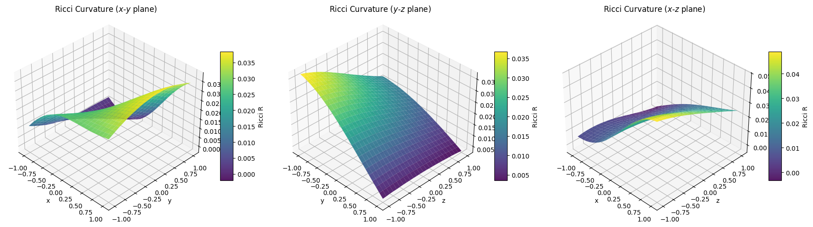
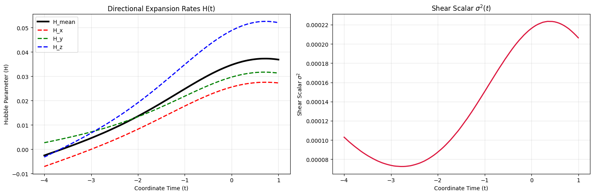

## Transitioning from Soft Penalties to Hard Constraints

In my [previous post](/blog/lumpyspace2/), I introduced a trainable matter
density parameter $\Omega_m$ and a soft penalty to enforce the Weak Energy
Condition (WEC), which requires the local curvature, the Ricci scalar $R$, to be
non-negative ($R \ge 0$) everywhere. The model responded by rejecting Dark
Matter entirely, driving $\Omega_m$ straight to the baryonic floor of
$\approx 0.05$, and fit the Pantheon+ supernovae using a spatial curvature
dipole and anisotropic shear.

But I also noted a caveat: The WEC was implemented as a soft, quadratic penalty
in the loss function so the optimizer struck a mathematical compromise: It
allowed a slight residual negative curvature ($R < 0$) and non-zero
early-universe shear to help fit the raw supernova distances.

To take this inhomogeneous model seriously, we cannot allow the network to
compromise on general relativity. The physics must be a hard boundary. So, it's
time to call the physics cops.

### The Vanishing Gradient of Soft Constraints

Our initial WEC penalty was defined using a standard squared minimum:

$$\mathcal{L}_{\text{WEC\_soft}} = \text{mean}(\min(R, 0.0)^2)$$

Mathematically, this seems reasonable. If $R \ge 0$, the loss is zero. If
$R < 0$, the penalty scales quadratically.

However, this formulation has a fatal flaw at the boundary: the gradient of this
penalty is proportional to $2 \cdot \min(R, 0.0)$. As the curvature $R$
approaches the boundary from the negative side ($R \to 0^-$), the gradient
vanishes. The "restorative force" pulling the model back into the physical
regime becomes weaker and weaker the closer it gets to satisfying the law,
allowing the network to comfortably park itself in a state of mild violation.

To fix this, we made two key changes:

#### Linear Violation Penalty

We changed the penalty term from quadratic to linear:

$$\mathcal{L}_{\text{WEC}} = \text{mean}(\max(0.0, -R))$$

Because this function is linear for negative values, its gradient is a constant
non-zero step function. The network receives the exact same, strong restorative
gradient regardless of whether it is slightly violating the WEC or massively
violating it.

#### The Augmented Lagrangian Method

Instead of relying on a static, soft weight that the network can easily scale
away, we treat the energy condition as a true hard inequality constraint. The
total loss now incorporates a dynamic Lagrange multiplier
($\lambda_{\text{WEC}}$) alongside a quadratic penalty term:

$$\mathcal{L}_{\text{Total}} = w_P \mathcal{L}_{\text{EFE}} + w_D\mathcal{L}_{\text{Data}} + \lambda_{\text{WEC}} \mathcal{L}_{\text{WEC}} + \frac{w_{\text{WEC}}}{2} \mathcal{L}_{\text{WEC}}^2$$

Inside our JIT-compiled training loop, the Lagrange multiplier dynamically
accumulates at every single optimization step based on the remaining WEC
violation:

$$\lambda_{\text{WEC}} \leftarrow \lambda_{\text{WEC}} + w_{\text{WEC}} \mathcal{L}_{\text{WEC}}$$

If the network attempts to violate the WEC, the multiplier
$\lambda_{\text{WEC}}$ climbs higher and higher, acting as a feedback loop that
increases the cost of violation until the network is forced back into
compliance.

### The Lazy Optimizer Trap: Why We Avoided Self-Adaptive Weights

It's worth mentioning an architectural trap we fell into while trying to balance
these competing physical constraints. We attempted to use ["Homoscedastic
Uncertainty Weighting"](https://arxiv.org/abs/1705.07115): a popular PINN method
that makes the loss weights ($\sigma_i$) learnable parameters, dynamically
balancing gradients by minimizing
$\sum \left( \frac{\mathcal{L}_i}{2 \sigma_i^2} + \log \sigma_i \right)$.

While elegant, I discovered that it creates a **"Lazy Optimizer" problem**. The
Einstein Field Equations are a highly rigid, non-linear system, so finding a
metric that satisfies them is difficult[^1]. Faced with a high physics loss
early in training, the optimizer found it mathematically cheaper to just drive
$\sigma \to \infty$ to artificially zero out the effective loss, rather than
actually solving the differential equations! This completely stalled the
training. I reverted back to hand-tuned static hyperparameters and the
Augmented Lagrangian, which act as unyielding constraints that _force_ the
network to solve the physics.

### The Spatial Curriculum: Learned 4D Spatial Weights

With homoscedastic uncertainty weighting failing globally across different loss
components, I realized that the core issue wasn't balancing the _types_ of
physics, but balancing the _locations_ of the physics.

Because our metric has discovered an inhomogeneous spatial curvature dipole, the
differential equations are significantly harder to satisfy in some regions of
space-time than others. Specifically, the gradients in the high-redshift past
($t \approx -3.0$) are massive compared to the local universe where the
supernova data sits ($t > -2.5$). The model was struggling to converge on the
Weak Energy Condition because the gradients were dominated by these boundary
regions.

To solve this, I introduced a tiny, auxiliary neural network: the
`spatial_weight_net`. This network takes the full 4D spacetime coordinate
$(t, x, y, z)$ and outputs a single scalar attention weight $W(t, x, y, z)$.

We then apply the homoscedastic uncertainty formula locally at every spatial
point:

$$\mathcal{L} = \frac{1}{2} e^{-2W} \mathcal{L}_{\text{raw}} + W$$

This acts as a completely automated [spatial
curriculum](https://arxiv.org/abs/2605.15254). The network learns to dynamically
scale down the loss in regions of extreme gradient magnitude by increasing $W$
locally. As it solves the "easy" zones, it naturally decreases $W$ in the harder
zones to focus its attention there.

#### Applying the Curriculum to the Physics Cops

To ensure the Augmented Lagrangian (AL) penalty for the WEC is not dwarfed by
the massive gradients of the supernova data, we integrate the point-wise AL
penalty directly into the spatial curriculum.

By computing the total physical error (EFE residual + AL penalty) _before_
applying the $e^{-2W}$ attention map, the network can massively amplify the AL
penalty in the exact regions where the WEC is violated. This ensures that the
hard physics constraint is optimized effectively, forcing the network to solve
the complex spatial geometry systematically rather than relying on Dark Matter.

### Results

During training, the WEC loss ($\mathcal{L}\_{\text{WEC}}$) eventually dropped,
though it took quite a bit more training than previous runs. As you can see in
the loss profile below, right around step 5400, the telemetry logged a value of
exactly **`0.000000e+00`**.

Because the WEC loss is the average of the violation over the entire coordinate
grid, hitting exactly zero means the Ricci scalar $R \ge 0$ at **every single
coordinate point** evaluated. The feedback loop worked as intended. When the
model drifted slightly, the accumulated Lagrange multiplier responded by pulling
it back down to zero.

#### Visualizing the Spatial Curvature Today

We generated fresh 2D spatial maps of the Ricci scalar curvature today
($t = 1.0$):

Looking at the bottom row (Ricci Curvature $R$), the colorbars show a clear
improvement. The negative-mass shortcuts have been largely eliminated. (You
might notice a microscopic `-0.006` minimum in the $x$-$z$ plane colorbar
despite the loss logging exactly zero. This is a PINN quirk: we enforce
on a finite set of random collocation points. Between those points, the
continuous neural network can still "ripple" slightly below zero, but it's
tightly bounded on a macroscopic scale!).

And once again, $\Omega\_m$ was driven straight to the baryonic floor of `0.05`.
Even under strict general relativity, the universe rejects the homogeneous Dark
Matter assumption.

#### Interpreting the Inhomogeneous Geometry

With the spatial curriculum active, we can visualize the complex, valid
spacetime geometry the network has discovered. Check out these 3D surface plots
of the Ricci curvature:

The network hasn't just found a simple gradient; it has discovered a saddle-like
topology in the spatial curvature. The curvature bends and warps dynamically
across the $x$-$y$, $y$-$z$, and $x$-$z$ planes, adapting to fit the anisotropic
supernova distances while being bounded by the WEC penalty pulling it up from
the zero-plane. This inhomogeneous structure demonstrates how the model can
explain the data without relying on Dark Matter.

### The Next Frontier: The past drifts

Enforcing the laws of physics as a hard boundary has solved our negative mass
problem, but it has revealed a new, fascinating artifact in the early universe
($t = -4.0$):

In the left panel, the directional Hubble parameters ($H(t)$) start near zero or
slightly negative in the past ($t = -4.0$). In the right panel, the shear scalar
($\sigma^2(t)$) bends back up to $\approx 1 \times 10^{-4}$ at $t =
-4.0$.

As the matter density is so low ($\Omega\_m = 0.05$), the universe in the past
($t \in [-4.0, -2.5]$) behaves like a vacuum. Without a heavy background of
matter to drive cosmic expansion and deceleration, and because we have no
observational supernova data in the far past (Supernovae only go up to
$z \approx 2.3$, or $t \approx -2.5$), the neural network's extrapolation is
free to drift. Under pure vacuum field equations, it drifts into a
static/contracting past with positive shear.

But the Cosmic Microwave Background (CMB) tells us that the early universe
($z \approx 1100$, or $t \ll -4.0$) was highly isotropic and expanding.

#### What's Next: Enforcing the CMB Constraints in the Early Universe

To address this, we must introduce the final pieces of the physical puzzle: a
three-part **Early-Universe Prior** applied at $t \le -3.0$. To ensure our model
merges smoothly with standard FLRW cosmology at high redshifts and matches the
stunning uniformity of the Cosmic Microwave Background, we will penalize three
things in the early universe:

1. **Negative Expansion ($H_{\text{mean}} < 0$)**: The universe must be
   expanding.
2. **Anisotropic Shear ($\sigma^2 > 0$)**: The expansion must be isotropic in
   all directions.
3. **Spatial Gradients ($\sum (\partial_i g_{\mu\nu})^2 > 0$)**: We must enforce
   spatial homogeneity to prevent the network from hiding massive curvature
   dipoles in the early universe, which would violently conflict with the
   $10^{-5}$ density perturbations of the CMB.

By anchoring the network with these physical boundary conditions in the deep
past, the Einstein Field Equations will naturally propagate that smoothness
forward, preventing the unphysical "past drifts" without us having to explicitly
simulate complex recombination plasma dynamics.

Stay tuned!

[Next post](/blog/lumpyspace4) in the series.

[^1]: understatement, again
