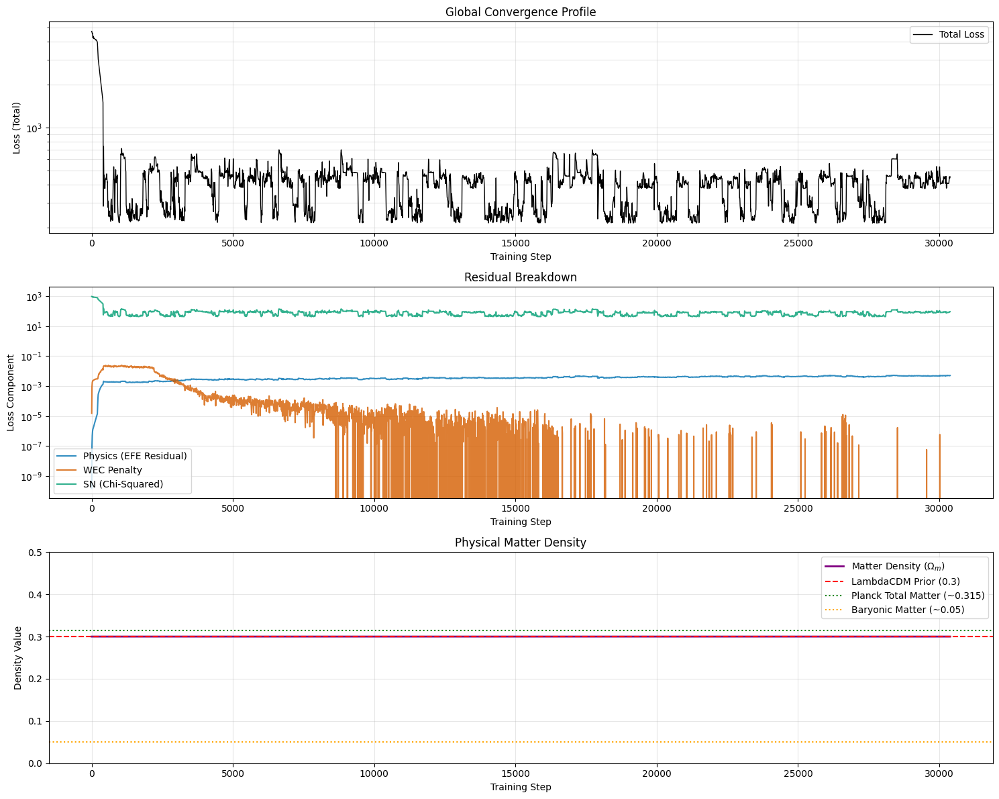
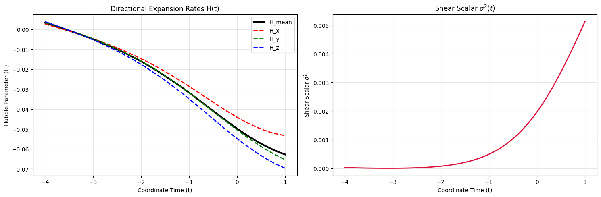
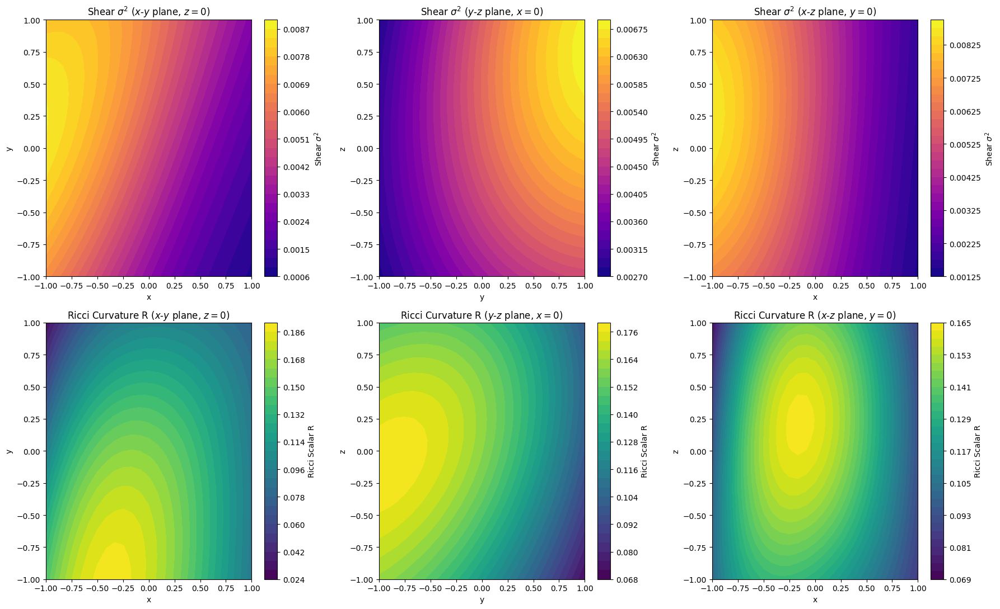
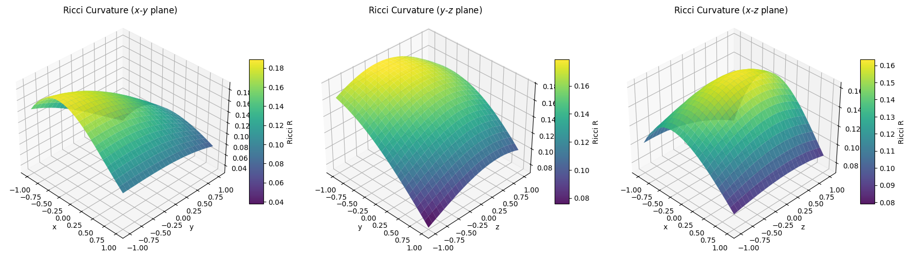

## A Confession

In my [previous post](/blog/lumpyspace3/), I explained that we had
implemented an Augmented Lagrangian (AL) method to strictly enforce the Weak
Energy Condition (WEC). I shared monitoring showing the WEC loss dropping to
exactly `0.000000e+00`.

However, it turns out we had fallen victim to a silent scoping bug inside the
JAX `@eqx.filter_jit` compiler.

To capture static hyperparameters (like `w_efe`, `w_sn`) without passing them
explicitly, we wrote our `loss_fn` as an internal closure inside the compiled
`step` function. This is a common JAX pattern. However, the Augmented Lagrangian
multiplier ($\lambda_{\text{WEC}}$) is a dynamic array that changes every single
optimization step.

We dutifully passed the dynamic `lambda_wec` array into the `step` function
signature. But inside the `loss_fn` closure, we accidentally referenced the
python variable `lambda_wec_val` from the *outer* training scope—which had been
initialized to exactly `0.0` before the training loop started.

When JAX traces a function for the first time to compile it into an XLA graph,
it captures outer-scope variables as static constants. JAX saw
`lambda_wec_val = 0.0` and hardcoded it.

While our outer python loop was happily calculating the AL multiplier and
printing updated $\lambda$ values to the terminal, the neural network inside the
JIT-compiled graph was blindly calculating `0.0 * violation` on every single
step. The network never felt the compounding Augmented Lagrangian pressure at
all!

The "compliance" we saw in the previous post was simply the network reacting to
the standard quadratic penalty ($\frac{\mu}{2} \text{violation}^2$). We had
accidentally degraded our advanced AL method into a basic Quadratic Penalty
Method.

We have since patched the scoping bug. The network will now feel the true
pressure of $\lambda$.

### Re-balancing the Sampling Tension

To ensure the network didn't use unobserved coordinate gaps to hide
singularities or workarounds to the constraints, I increased our spacetime
sampling to $t=[-3.9, 1.0]$ and bumped our grid sampling to 1000 points. I also
re-balanced the grid to a strict **800/200** split. This anchors the active
Supernova region with $\approx 228$ points per unit, while still giving the deep
past enough resolution ($\approx 133$ points per unit) to prevent mathematical
aliasing.

### The "Shock Absorber": Adaptive Penalty Scheduling

Even with the AL multiplier un-frozen and the true $\lambda_{\text{WEC}}$
penalty applied, we discovered a new failure mode: the "Lazy Optimizer." If
the penalty parameter $\mu$ is fixed, a deep neural network will often find a
local minimum where it just balances the data loss against the physical
penalty instead of driving the physical violation to absolute zero.

To combat this, we completely encapsulated the Augmented Lagrangian state and
implemented an **Adaptive Penalty Scheduler**.

By tracking an Exponential Moving Average (EMA) of the constraint violation,
the scheduler acts like a mathematical shock absorber:
- When the network is making good progress (the EMA is dropping), the
  scheduler completely backs off and lets the gradients descend naturally.
- When the network stalls or tries to cheat (the EMA fails to drop by at
  least 10% over 500 steps), the scheduler violently scales the penalty
  weight $\mu$ by a factor of 10.

If the network stalls for 500 steps, the penalty rockets from
$1.0 \rightarrow 10.0 \rightarrow 100.0 \rightarrow 1,000.0 \rightarrow 10,000.0$.
This builds a massive brick wall that forces the optimizer right back into
physical reality the second it gets lazy.

## The Results

First, let's look at the convergence and physical parameters:

The Augmented Lagrangian method performed as expected though it took a lot
longer to get there than previously, due to the sampling of the longer
time-range. The WEC penalty (`l_wec`) hit a stable `0.000000e+00` however, look
at the bottom panel. The matter density $\Omega_m$ is stuck at $0.3$. It did not
drop to the baryonic floor like it did in previous runs.

In our earlier runs, the sparse sampling allowed the network to hide small
regions of negative energy between evaluation points. The network used this
negative energy to generate the acceleration required to fit the Supernova
data, which allowed it to drop $\Omega_m$. Now that the grid is densely sampled
down to $t=-3.9$, the network is fully constrained by the WEC everywhere.

Without negative energy or a Cosmological Constant, how is it fitting the
Supernovae? Let's check the kinematics:

The network has found a mathematically valid but physically backward solution.
It describes a collapsing universe.

To fit the Supernova data while collapsing, the network discovered a
mathematical loophole: it uses severe time-dilation (a cosmological
gravitational well) to perfectly mimic the redshift of an expanding universe!

We know our actual universe is not doing this thanks to Big Bang Nucleosynthesis
(which requires true spatial compression in the past) and structure formation
dynamics. But the Einstein Field Equations are time-reversible and
supernova data alone cannot break this degeneracy, so the neural network drifted
into a local minimum where the universe is contracting ($H_{\text{mean}} < 0$).

## The Real Next Frontier: Anchoring the Early Universe

These results show that we cannot rely on the Einstein Field Equations alone
to define the arrow of time. This brings us to the CMB Priors.

By anchoring the deep past with explicit penalties against negative expansion
and anisotropic shear, we can break the time-reversal symmetry and force the
network into an expanding phase. This will test whether an inhomogeneous,
expanding universe can explain the Supernova data without Dark Matter.

Without observational data to guide it, the time-reversible nature of general
relativity allows the neural network to mathematically drift into a contracting
phase ($H < 0$) with high spatial shear.

But we *do* have observational data about the deep past: the Cosmic Microwave
Background (CMB). The CMB guarantees that at high redshifts, the universe was
isotropic, highly homogeneous, and actively expanding.

### Implementing the CMB Constraints

At the deepest boundary of our computational domain ($t \in [-4.0, -3.9]$), we
will deploy our (now fully functional) Augmented Lagrangian method to penalize
three specific geometric deviations:

1. **Expansion Rate ($H_{\text{mean}} < 0$)**: We explicitly penalize negative
   expansion. This breaks the time-reversal symmetry of the Einstein Field
   Equations and forces the network out of the "contracting universe" local
   minimum.
2. **Anisotropic Shear ($\sigma^2 > 0$)**: We penalize any non-zero shear
   scalar, forcing the early universe to be perfectly isotropic.
3. **Spatial Gradients**: We penalize the spatial derivatives of the metric
   components ($\sum (\partial_i g_{\mu\nu})^2 > 0$), forcing the early universe
   to be smooth and homogeneous, matching the $10^{-5}$ density perturbations of
   the CMB.

By anchoring the deep past with these three CMB priors, the Einstein Field
Equations will naturally propagate that smooth, expanding geometry forward in
time. This forces the neural network to solve the complex, inhomogeneous
Supernova geometry in the local universe *without* relying on bizarre artifacts
in the unobserved past.
