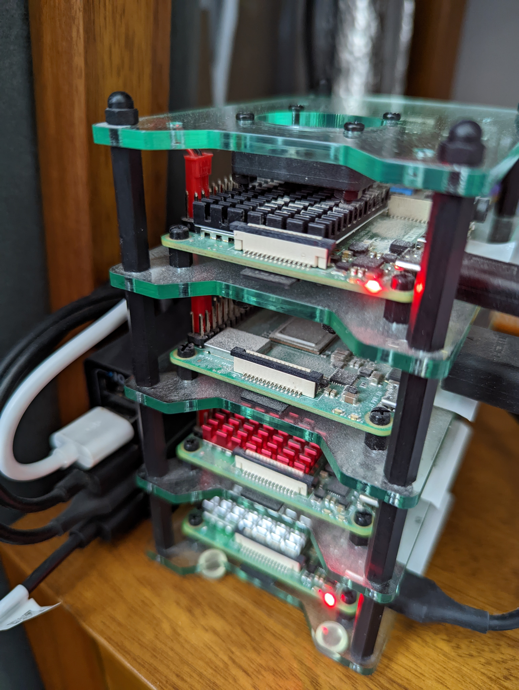
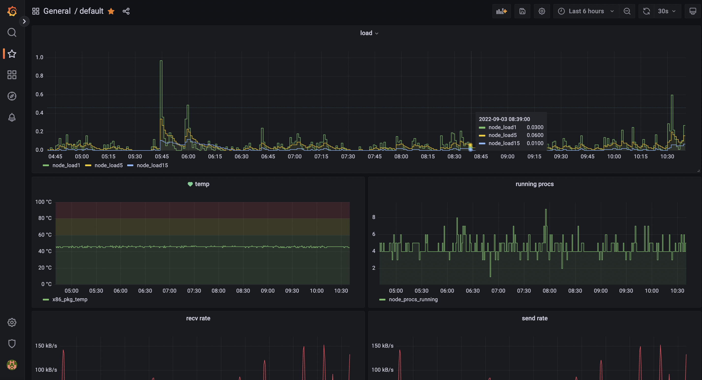

+++
title = "quark is up"
author = "dominic"
date = "2022-06-26"
tags = [
  "linux",
  "server"
]
+++

A few weeks ago I finally upgraded the homelab from Intel NUC-as-a-server to 
a real honest-to-goodness rackmount server.  `chef` has "served" (hah) us well 
for years, being an Intel NUC with 4TB spinning disk and a 250GB SSD, but I've 
had aspirations for something more for a while.

I set up the rack when we moved into this house three years ago, and it's hosted
a patch panel, Netgear 48-port switch, and various smart home hub devices. It 
also hosted the Raspberry Pi running [pi-hole](https://pi-hole.net) before that 
moved to the cluster[^1].

The newest addition to the family is `quark`: a Supermicro shallow-depth 1U 
server with an Atom 4-core processor, 500GB SSD, 32GB RAM and 8TB of spinning 
disks in a Raid 0 array[^2].  There are extra empty RAM slots and four extra 
spinning disk slots to fill in the future.  I got it prebuilt from
[Broadberry](https://www.broadberry.co.uk) and I want to give them a shout-out
too as their service was great, even amongst the supply chain issues.

## OS stuff

The first and most important decision to make was, of course, which Linux 
distribution to use.

My default for years has been [Debian](https://debian.org), but I wanted to try 
something new, and the [hachyderm.io](https://hachyderm.io) Discord were fairly 
adamant that [Arch](https://archlinux.org) is the way.

I am not disappointed, and have become a total Arch convert.  Installation was 
straightforward, and the only slight glitch I've had has been an issue with the 
UEFI boot.

While the server supports EFI, it doesn't have good enough UEFI support for
[EFISTUB](https://wiki.archlinux.org/title/EFISTUB) to work.  Ie, i can't boot 
to the kernel from the BIOS directly. At some point I will install a 
bootloader, but for now it's quite straightforward to boot to the EFI shell and 
run a one-liner (script) to load linux.

When it came to partitioning, I decided to separate the `/home` partition from 
`/` as I have plenty of space on the SSD to maximise both and it gives me extra 
flexibility should I need to move things around later.  The hard drive array is
mounted as `/big` and access is controlled through the user group `biggers`.  I
don't know how much groups are used in modern Linux administration, but I find 
it the most natural approach for managing ACLs on the filesystem.

## Services

I only have a few services running at the moment:

1. `nginx` of course, to host both internal and external sites, and to act as 
a reverse proxy for the other services.  Internally I am running
[flame](https://github.com/pawelmalak/flame) as a self-hosting dashboard, and 
I'm in the process of moving my personal sites, including this one, from 
[dreamhost](https://dreamhost.com), who as I've said before 
[are great](/blog/speed-give-me-what-i-need.md), to being hosted from home.

1. I'm also running some media streaming and binary usenet clients for reasons 
([sonarr](https://sonarr.tv), [nzbget](https://nzbget.net),
[jellyfin](https://jellyfin.org)).  These replace sickbeard, sabnzbd+, and 
plex, respectively, as they are better maintained and (in the case of jellyfin 
vs plex, at least) don't call home.

1. To make it feel a bit more like a real setup, i'm also running some 
monitoring software: [prometheus](https://prometheus.io) and
[grafana](https://grafana.com).

    a. I was running grafana previously, with an
    [influxdb](https://www.influxdata.com) and [collectd](https://collectd.org) 
    setup, and it was painful to onboard new nodes.  With the new setup I'm 
    able to add a new node simply by installing `prometheus-node-exporter` and 
    pointing `quark`'s prometheus instance to it.

    b. As well as the `prometheus-node-exporter` on every machine, I'm running 
    `prometheus-blackbox-exporter` to probe all the running services.

    c. I may add some custom exporters for specific services as necessary.

## Why "quark"?

No, it's not named for the subatomic particle, or the Star Trek character.  All 
of my devices are named for computers or robots from
[Dr Who](https://www.doctorwho.tv).  The current set include `kamelion`, 
`xoanon`, `xylok`, `tardis`, `k9`, `k1`, and now `quark`.

## What's next?

I'm not sure.. i might see if i can centralise some of the smart home stuff
and self host instead of relying on Hue/Yale/Ikea/Whoever wants me to set up 
accounts and send every API request over the internet before turning a light
on.  I'm tempted to move the minecraft server too, but I quite like the idea 
of running those on the raspi cluster.  Though it would free up the cluster to 
be available for ad-hoc work[^3], I'm concerned the load might gum up quark.

I'll need an RSS reader, so maybe host miniflux... move [the blog](https://hamon.dev)
over to it.. then obviously set up nftables for some firewall goodness and try
not to lock myself out.

Now I'm an Arch convert, I'm figuring out what I can do to support it and give 
something back.

It's tempting to step way back into my past and self-host mail, run a local
NNTP server, and eschew the web for `mutt` and `tin`, but that may be nostalgia
talking.

I'm open to any suggestions for services I could/should run:
[@dma@hachyderm.io](https://hachyderm.io/@dma).

[^1]: also containing two minecraft servers and a retropie.
[^2]: I have offsite backups so I don't need the redundancy, but I may want to 
add more later and the read/write throughput matters more. 
[^3]: Using [sprinkle](https://github.com/dmah42/sprinkle), naturally.
