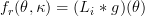
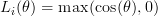
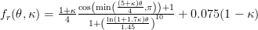
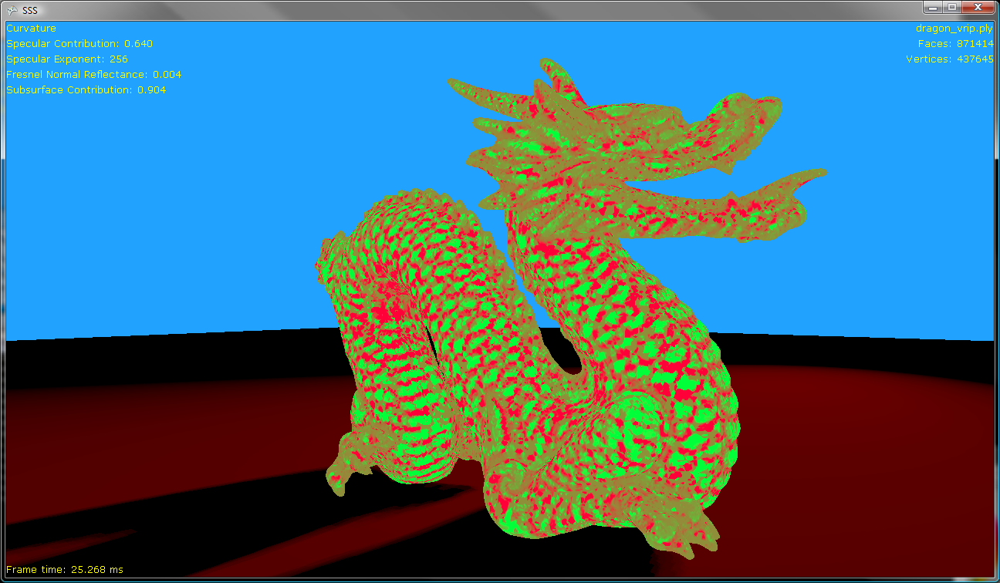
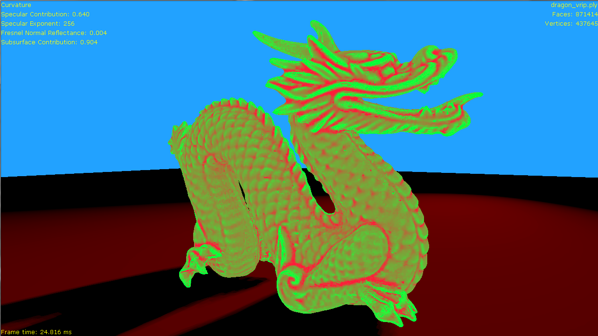
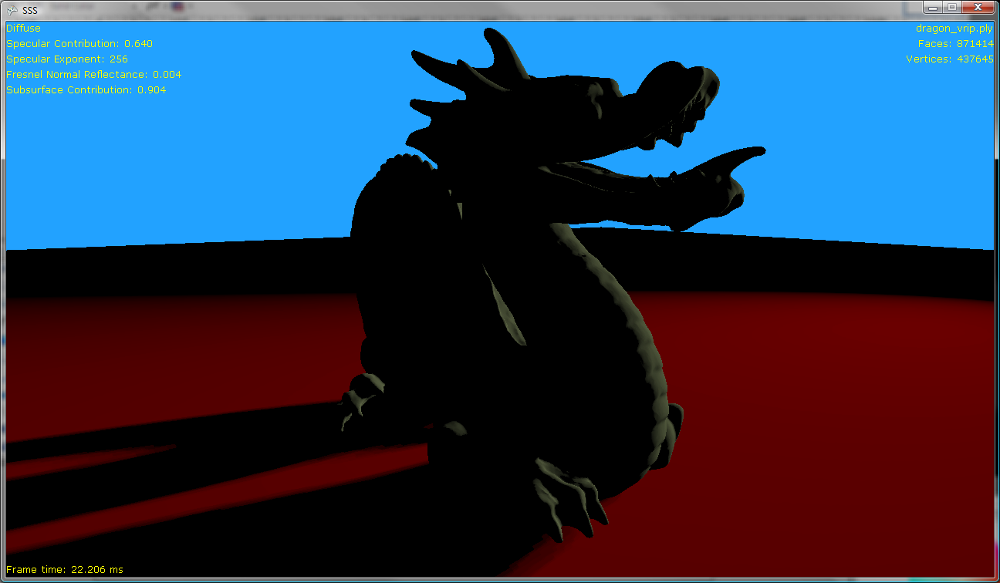
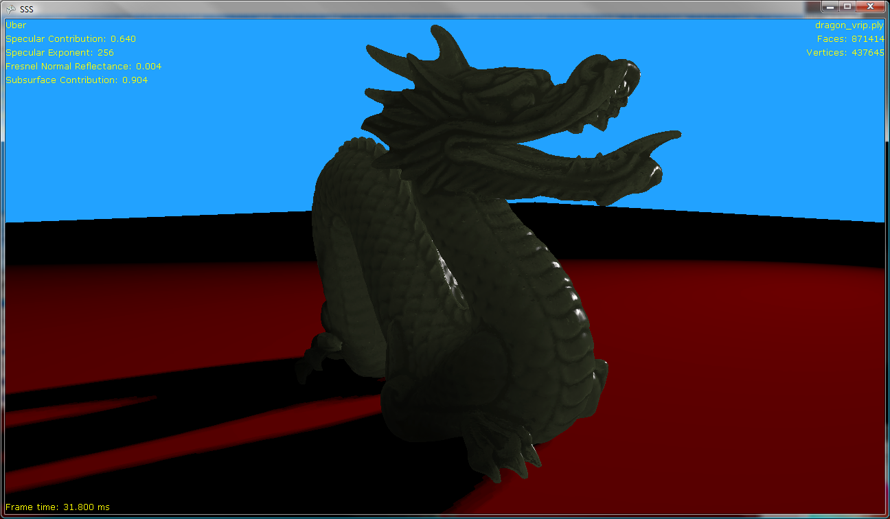

+++
title = "sub-surface scattering with cdrf"
author = "dominic"
date = "2010-08-25"
categories = [
  "C++"
]
tags = [
  "rendering",
  "C++"
]
+++

# Sub-surface scattering with CDRF

## Introduction
In [this paper](http://portal.acm.org/citation.cfm?id=1837026.1837086), Kubo,
Dobashi and Morishima present a compelling case for using a curvature dependent
reflectance function (CRDF) to simulate sub-surface scattering. The basic idea
is that smaller objects with higher curvature exhibit more noticeable
sub-surface scattering than flatter ones. Using photon mapping with spheres,
the authors found a reasonable relationship between the curvature of the sphere
(the inverse of the sphere’s radius) and the radiance across the sphere. With
the only examples in the paper shown being fairly close to spherical, I wanted
to see if I could use their technique, or a variant of it, to get a cheap
sub-surface scattering effect on a more complicated mesh. Like, say, the dragon
from Stanford’s [3d scanning repository](http://graphics.stanford.edu/data/3Dscanrep/)

## The mathematics
First, the authors of the paper attempt to fit their data using the following
CDRF:

<!-- TODO: use mathjax or equivalent -->

Where is the incident light energy and is a gaussian:

As can be seen from figure 2(c) in the paper, this is not a particularly
good fit though it does match the data qualitatively with a Lambert type
shape at low curvature which spreads at higher curvatures.

However, a better quantitative fit is given by (thanks to
<a href="http://ccollomb.free.fr/" class="vt-p">Cedrick Collomb</a> for
help with this):  

Once you have this, it’s time to move on to measuring the curvature of
your mesh.

## Mesh curvature
There are a [few different techniques](http://jn.wspc.com.sg/ijsm/mkt/free/S0218654306000810.pdf)
out there for determining the local curvature of a mesh, but the two main
techniques involve either finding an analytical formula or patch that fits the
mesh around the vertex you are interested in, or determining the curvature
directly from the vertex and normal information. As this was just a prototype,
I went with the more performance friendly, and less work-intensive, option of
determining the curvature directly from the mesh.

My first attempt was inspired by [this paper](http://citeseerx.ist.psu.edu/viewdoc/download?doi=10.1.1.108.8089&amp;rep=rep1&amp;type=pdf)
where the area of each ring of faces around a vertex is compared to the area of
those same faces projected onto a unit sphere. This gives a measure of the
Gaussian curvature of a mesh which is an intrinsic property of any surface.
When applied to a series of test meshes, the results were less than ideal. The
sign of the curvature appears correct, but the magnitude depends heavily on the
size of the faces, as you would imagine from the definition.

I did attempt to extend the neighborhood used to calculate the Gaussian
curvature to two rings, but this had two negative effects: The local curvature
was smoothed out too much in some places, and other places the technique became
invalid as it relies on the sign of curvature not changing within a
neighborhood.

These limitations led me to a definition of curvature that is not an intrinsic
property of a surface, but depends on the space a surface is embedded in. As I
can control the ambient space within my test program and ensure it remains
Euclidean (side note – has anyone considered making a game set against a
non-Euclidean space?) this measure is still valid for my requirements.

This technique, outlined in [this paper](http://math.lanl.gov/Research/Publications/Docs/garimella-2003-curvature.pdf)
again compares areas of faces within the neighborhood of a vertex, but as the
area of the face appears in both the numerator and the denominator of the ratio,
the magnitudes of curvature are more well-behaved both locally and across the
mesh. My results from this technique were far more useful.

## Putting it all together
So now you have an intimidating formula linking local curvature and incident
light angle to outgoing radiance. What happens when you put it together?

First, here’s a baseline. The dragon with a simple Lambert BRDF:  

Now replacing this with the CDRF from the original paper:

The diffuse lighting is clearly wrapping around the model more, as expected,
however there are some issues. Note in particular the spine of the dragon which,
being thinner, should show more transmission. However, as it has flat curvature
when compared to the thicker body of the dragon, it transmits less.

To compare, here’s an image of the same mesh, with the same data, but using a
more traditional depth-based technique for sub-surface scattering:

Which clearly shows the transmission effect, but where we might expect the
scattering effect to be pronounced, around the details in the face, for example,
we lose all detail.

While it is true that transmitted light will focus into areas of high curvature,
this is an additional effect on top of how far the light has to travel within
the model. So perhaps by combining these effects and using the CDRF to add a
curvature dependent term to the depth-based sub-surface scattering model, we
might get something better than either:

Which has all the benefits of a depth-based technique but with the added benefit
of concentrating the transmission where the curvature has a high positive
magnitude and darkening the transmission where the curvature is negative.

However, we can combine the curvature with the depth-based sub-surface
scattering effect in other ways. We can use the curvature of the model directly
to lighten and darken the transmitted light. This should add detail back in
without the expense of the CDRF calculations and looks like this:

This, in combination with a Blinn-Phong BRDF and a Fresnel reflectance term,
gives us something that starts to approximate jade:

## Summary
While the original application of the local curvature of a mesh does not provide
a good model of sub-surface scattering for more general cases, it can certainly
be applied to existing techniques to add subtlety to the transmission and
scattering of light through a model.

## Comments
_these comments are preserved from the original blog post_

1.  John says:

    [2010/09/11 at
    10:08](/blog/2010/08/sub-surface-scattering-with-cdrf/#comment-37)

    hey, nice blog…really like it and added to bookmarks. keep up with
    good work

2.  [Kaye Enriguez](http://garmin1350.com/) says:

    [2010/09/18 at
    02:36](/blog/2010/08/sub-surface-scattering-with-cdrf/#comment-38)

    What a comment!! Very informative and also easy to understand.
    Looking for more such writeups!! Do you have a twitter or a
    facebook?  
    I recommended it on digg. The only thing that it’s missing is a bit
    of speed, the pictures are appearing slowly. However thank you for
    this information.

3.  [2010/10/03 at
    02:39](/blog/2010/08/sub-surface-scattering-with-cdrf/#comment-39)

    \[…\] This post was mentioned on Twitter by Hirofumi Suda, Hiroyuki
    KUBO. Hiroyuki KUBO said:
    おお、どなたか知らんが、追実装してくださっとる。（若干微妙な実装してるきがするが。。。）ありがたや。http://bit.ly/9WIc78
    \[…\]

4.  [Luella Manero](http://www.guildwars2movies.com/) says:

    Wonderfull, do you happen to have a tweeter i can follow up? really
    interested.bye

5.  Hiroyuki Kubo says:

    [2010/10/14 at
    20:50](/blog/2010/08/sub-surface-scattering-with-cdrf/#comment-41)

    Thank you for your interest in my work. I’m an author of that
    paper.  
    The model “dragon\_vrip.ply” you try to render, it is difficult to
    compute smooth curvature because it contains artifacts (small
    spikes) on the surface. I guess it is because of surface
    reconstruction , but not sure. To compute better, efficient
    curvature, you had better to use “dragon\_vrip\_res2.ply”.

    Then, I have one question. I cannot understand the equation you
    post. Where is sigma0?

    Using our method, I’ve already render “dragon\_vrip\_res2.ply”.
    Please visit here  
    <a href="http://twitpic.com/2xops7/full" class="uri uri">http://twitpic.com/2xops7/full</a>

    Again, thank you very much for this wonderful article. If you need
    more information, please send an email to me.

    -   dominic says:

        [2010/10/16 at
        14:22](/blog/2010/08/sub-surface-scattering-with-cdrf/#comment-42)

        Thank you for taking the time to reply, and the interest in my
        work. You’re right that the curvature results are better with
        the lower resolution meshes.

        The render you shared appears to have the camera on the same
        side of the light. Do you have a render from the back of the
        mesh that shows transmission of light through the model? Also,
        is there a wavelength dependent term in your CRDF to give the
        blue tint in areas of high curvature?

        As for the equation, I don’t have a sigma0 in there as the CDRF
        only depends on theta and kappa.

