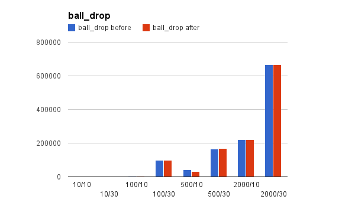
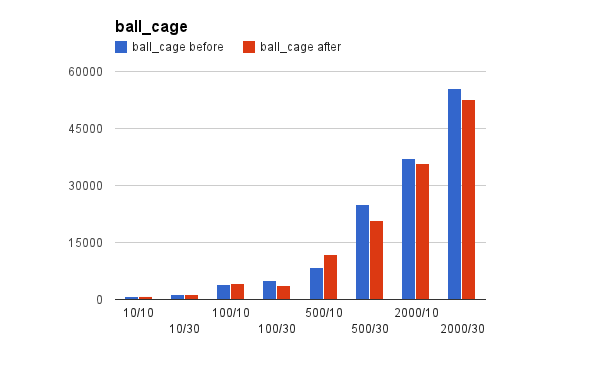
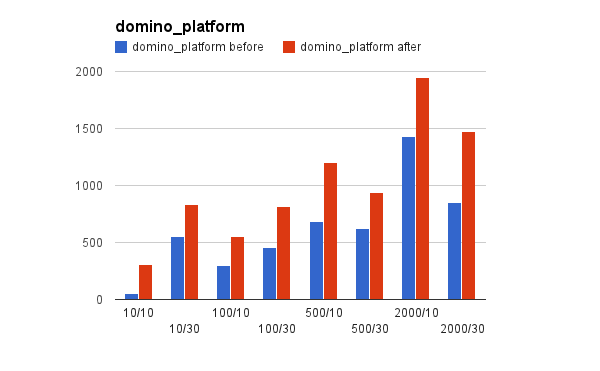

+++
title = "typed data for performance boost"
author = "dominic"
date = "2013-06-05"
categories = [
  "dart"
]
tags = [
  "dart",
  "performance"
]
+++

After reading John McCutchan’s recent post on [numeric
computation](http://www.dartlang.org/articles/numeric-computation/ "Numeric Computation")
in Dart, and a conversation with Srdjan Mitrovic from the Dart VM team, I made
some changes to the [Dart](http://dartlang.org/) port of [Box2D](http://box2d.org/)
in the hope of improving performance. The specific commits that make up this
change are
[here](https://github.com/dart-lang/dart-box2d/commit/5ba30dacf2a16861620e18d692546f0339e3bd4d)
and
[here](https://github.com/dart-lang/dart-box2d/commit/93b05e3374e1bd7d16f10ac941317a41ad81bfb0),
and this change has been released to pub as version 0.1.6.

Originally, I had attempted to port the internal math library to John’s
[vector\_math](http://pub.dartlang.org/packages/vector_math) library.  For one,
this would mean that I no longer need to maintain a chunk of code, and for
another it means any work he does to introduce SIMD into the library will
automatically be available to me. However, this integration introduced some
major instabilities into one of the collision solvers so I abandoned it.

Instead, I made two key changes to the code: Converted all `num` types to
`double`, and converted the vector and matrix types to use typed data instead of
double stored in fields. First, the results. All benchmark code can be found
[here](https://github.com/dart-lang/dart-box2d/tree/master/example/benchmarks)
and were run under SDK version 0.5.11.1\_r23200. In all the below charts, the
y-axis is the number of steps simulated per second, hence bigger is better.

## Results

This simple benchmark shows little difference in performance across the board.

This simple benchmark shows a performance regression for higher step counts.
This may be a sign that some parts of the code haven’t been updated to use
doubles so the VM is having to do extra work.

The first of the complex benchmarks with many collisions per frame shows a huge
improvement across the board. The performance was always fairly consistent, but
now it is consistently better.

The most complex benchmark (the one that exhibits the collision instabilities
under vector\_math) also shows huge improvement in performance.

## Rationale

It is clear from the above results that these changes have made a significant
positive difference to performance, but why? We’ll tackle each part of the
change in turn.

### doubles

The VM can work with doubles in an unboxed form which makes computations very
efficient. This does, however, break down when passing doubles to functions or
returning them from methods as this causes a box/unbox operation pair.
Similarly, storing a non-smi number in a field, as the old math library was
doing, causes a box operation as fields can only hold smi values or object
pointers. And that’s where typed lists come in.

### Typed lists

Typed lists in Dart can only hold numbers, not regular objects. Further, unlike
when working with integers, the double value does not need to be tagged. This
means that the storing and retrieving doubles from a typed list is very fast,
and also very memory efficient.

## JavaScript

This is all well and good for the VM, but what happens when this code is
converted to JavaScript, which is going to be the majority use-case at this
point? JavaScript stores all numbers as double precision floating point numbers
anyway, so there’s no conversion necessary there. Also, the typed lists map
trivially to the native typed arrays in JavaScript which also means no further
overhead.

## Conclusion

If you’re doing any kind of numeric computation in Dart, read John’s
[article](http://www.dartlang.org/articles/numeric-computation) again and follow
his advice. The tips he gives are not theoretical; they have a significant
practical performance impact.

