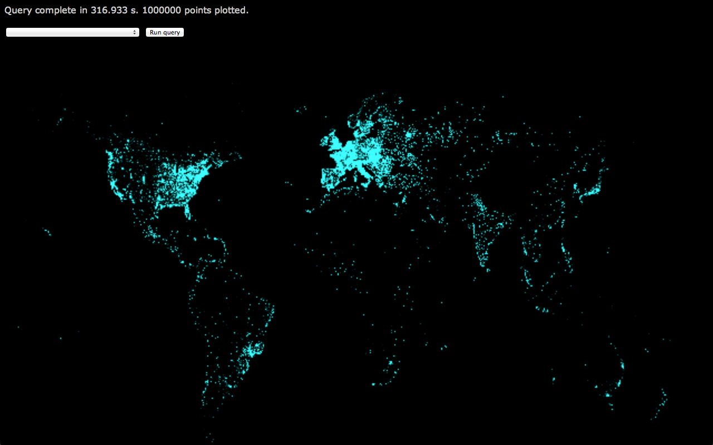
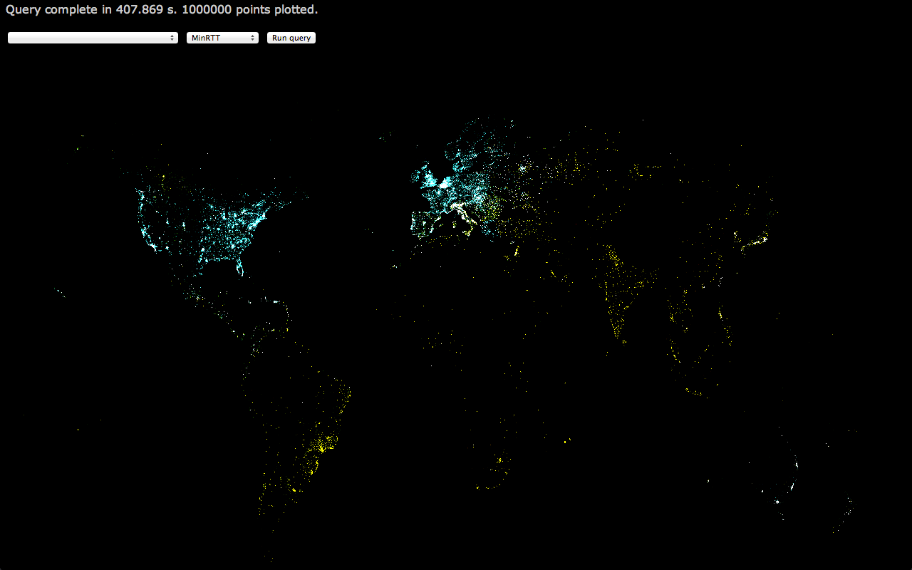

+++
title = "visualizing m-lab data with bigquery"
author = "dominic"
date = "2012-11-19"
categories = [
  "javascript"
]
tags = [
  "javascript",
  "dataviz",
  "m-lab",
  "web100",
  "rfc4898"
]
+++

I recently moved to a new group at Google: [M-Lab](http://measurementlab.net/).
The Measurement Lab is a cross-company supported platform for researchers to run
network performance experiments against. Every experiment running on M-Lab is
open source, and all of the data is also open; stored in [Google Cloud
Storage](https://developers.google.com/storage/) and
[BigQuery](https://developers.google.com/bigquery/).

One of the great things about having all that data open and available in
BigQuery is that anyone can come along and find ways to visualize it.  There’s a
few examples in the [Public Data Explorer](http://www.google.com/publicdata/explore?ds=e9krd11m38onf_ "Measurement Lab @ Google Public Data Explorer"),
but I was feeling inspired[^1] and wanted to know what it was like for someone
coming to M-Lab data fresh.

I decided to build something using HTML5 canvas and JavaScript so those are the
versions of the API that I’m using. However, there’s [broad language support](https://developers.google.com/discovery/libraries "Google API Client Libraries")
for the APIs.

## OAuth2 authentication

This step actually took the longest of the whole process. There are a number of
options when it comes to which type of key you need, and how you go about
getting one, and the documentation is thorough but not particularly clear.
Essentially you need to have view rights for the measurement-lab BigQuery
project, and a Client ID created for you by one of the owners. You can ignore
any documentation that talks about billing, unless you import the data into your
own BigQuery project before running queries against it. However, there’s no need
to do that, as a simple email to someone at M-Lab[^2] you can get a key for your
app and view access. This will allow you to run queries at no cost to you.

Once you have a key, it’s time to authorize:

```html
    <html>
      <head>
        <script src="https://apis.google.com/js/client.js"></script>
        <script
            src="https://ajax.googleapis.com/ajax/libs/jquery/1.7.2/jquery.min.js">
        </script>
        <script>
          var project_id = 'measurement-lab';
          var client_id = 'XXXXXXXXXXX';
          var config = {
            'client_id': client_id,
            'scope': 'https://www.googleapis.com/auth/bigquery.readonly'
          };
          function auth() {
            gapi.auth.authorize(config, function() {
                $('#status').html('Authorized..');
                gapi.client.load('bigquery', 'v2', function() {
                    $('#status').html('BigQuery client initiated.');
                    $('#auth_button').fadeOut();
                });
            });
          }

          function initialize() {
            if (typeof gapi === 'undefined')
              $('#status').html('API not available. Are you connected to the internet?');
            $('#status').html('Client API loaded.');
            $('#auth_button').fadeIn();
          }

      </head>
      <body onload="initialize();">
        <div id="status">Waiting for client API to load</div></br>
        <button id="auth_button" style="display:none;" onclick="auth();">
          Authorize
        </button>
      </body>
    </html>
```

With this, you should be able to hit the Authorize button, enter a Google
account (required for tracking by BigQuery, I believe) and load the BigQuery API
library. The Google account you use will have to have accepted the BigQuery
terms of service, which involves logging in to the BigQuery site and clicking
through the login.

Note, this is a bit of a pain for a multiple-user web application.  However,
there is the option to set up a server-to-server authorization flow which
removes this difficulty. Similarly, I believe native installed applications
have a different route for authorization but I haven’t looked into it yet.

## Your first query

For the purposes of this post, I wanted to get every distinct test that had been
run in a month and plot a point at the latitude and longitude of the client’s
location. By making the plotted pixel semi-transparent I could use additive
blending to make things glow a bit, and easily see areas where multiple tests
had run.

I’ll assume you know how to add a canvas to the page and draw to pixels. I’ll
focus instead on actually running the query.

```javascript
          function runQuery() {
            var query =
                'SELECT project,log_time,' +
                       'connection_spec.client_geolocation.latitude,' +
                       'connection_spec.client_geolocation.longitude,' +
                       'web100_log_entry.is_last_entry ' +
                    'FROM m_lab.2012_10 ' +
                    'WHERE log_time > 0 AND ' +
                          'connection_spec.client_geolocation.latitude != 0.0 AND ' +
                          'connection_spec.client_geolocation.longitude != 0.0 AND ' +
                          'web100_log_entry.is_last_entry == true ' +
                    'ORDER BY log_time';
            var request = gapi.client.bigquery.jobs.query({
                'projectId': project_id,
                'timeoutMs': '45000',
                'query': query
            });
            $('#status').html('Running query...');
            var startTime = new Date().getTime();
            request.execute(function(response) {
                var duration = (new Date().getTime()) - startTime;
                $('#status').html('Query complete in ' + duration / 1000 + ' s.');

                ... <clear canvas> ...

                $.each(response.result.rows, function(i, item) {
                    var latitude = parseFloat(item.f[3].v);
                    var longitude = parseFloat(item.f[4].v);

                    // Normalize to canvas
                    var canvas_x = w * (longitude / 360.0 + 1 / 2);
                    var canvas_y = h * (latitude / 180.0 + 1 / 2);

                    var canvas_x_int = Math.floor(canvas_x);
                    var canvas_y_int = Math.floor(canvas_y);
                    // Flip y for canvas
                    var i = (canvas_x_int + (h - canvas_y_int) * w) * 4;

                    ... <draw pixel i> ...
                });
            });
          }
```

There’s a few things to note here, but the main one is that this is a
synchronous call and will timeout and return no results if it takes longer than
45 seconds. It will also return a maximum of 16000 rows.  There are ways to
remove both of these restrictions which we’ll get to later.

Also, the key to getting values from each row is in the `item.f[3].v` lines.
The index there comes from the order of fields requested in the SELECT
statement.

Another thing to note is that longitude and latitude could be projected using
[Mercator](http://mathworld.wolfram.com/MercatorProjection.html "Mercator Projection @ mathworld")
or
[Equirectangular](http://mathworld.wolfram.com/EquirectangularProjection.html "Equirectangular Projection @ mathworld")
projections.

## Removing the restrictions

Both the synchronicity of the call and the timeout can be solved by polling for
the query to complete using the `jobs.getQueryresults` method.

With this change, the code above looks something like:

```javascript
          function runQuery() {
            startIndex = 0;
            var query =
                'SELECT log_time,' +
                        getColorField() + ',' +
                       'connection_spec.client_geolocation.latitude,' +
                       'connection_spec.client_geolocation.longitude,' +
                       'web100_log_entry.is_last_entry ' +
                    'FROM m_lab.2012_10 ' +
                    'WHERE log_time > 0 AND ' +
                          'connection_spec.client_geolocation.latitude != 0.0 AND ' +
                          'connection_spec.client_geolocation.longitude != 0.0 AND ' +
                          'web100_log_entry.is_last_entry == true ' +
                    'ORDER BY log_time LIMIT ' + maxPoints; 
            var request = gapi.client.bigquery.jobs.query({
                'projectId': project_id,
                'timeoutMs': pollTime,
                'query': query
            });

            $('#status').html('Running query');

            ... <clear canvas> ...

            startTime = new Date().getTime();
            request.execute(pollForResults);
          }

          function pollForResults(response) {
            if (response.jobComplete === true) {
              if (startIndex == 0)
                $('#status').html('Receiving data');
              startIndex += response.rows.length;
              plotResponse(response);
            }
            if (startIndex == parseInt(response.totalRows)) {
              var duration = (new Date().getTime()) - startTime;
              $('#status').html('Query complete in ' + duration / 1000 + ' s. ' +
                                response.totalRows + ' points plotted.');
              return;
            }
            if (typeof response.error === 'undefined') {
              request = gapi.client.bigquery.jobs.getQueryResults({
                  'jobId': response.jobReference.jobId,
                  'projectId': response.jobReference.projectId,
                  'timeoutMs': pollTime,
                  'startIndex': startIndex
              });
              request.execute(pollForResults);
            } else {
              $('#status').html('ERROR: ' + response.error.message);
            }
          }
```

As you can see, instead of having a long timeout, we have a short one.  When the
callback fires, if the job is not complete, we poll again with the same short
timeout. This continues until the job succeeds (or an error is returned). Note,
this means that even jobs that apparently timeout can remain running and
accessible from the API. If you want to cancel a job you need to `delete` it using the API.

So what do you get when you run this for 1 million points?



The points are a little fuzzy as I was using CSS to scale up the canvas for a
cheap blur effect.

## What else?

This is pretty enough, but the M-Lab data includes some terrific data regarding
the innards of TCP states on client and server machines throughout the tests
that are run. This is thanks to the [Web100](http://www.web100.org/) kernel
patches that run on M-Lab server slices. With those, it would be possible to map
out areas where congestion signals are more common, or the distribution of
receiver window settings. Or try to find correlations between RTT and the many
available fields in the schema.

As another simple example, by plotting short RTT in blue, medium RTT in green,
and long RTT in red (and removing the blur), you get something like:



If you look at the full-res version, you can see the clusters of red pixels
across India and South East Asia.

This is immediately useful data: Given the number of tests that are run in the
area (the density of points), and the long RTT we’re seeing from there, it would
make sense to add a few servers in those countries to ensure the data we have on
throughput and congestion for that area is not being skewed by long RTT.
Similarly, we can feel good about our coverage across Europe and North America,
though the less impressive RTT in Canada should be investigated.

## More?

Almost certainly, but I’m out of time on this little weekend project hacked
together between jaunts around Boston. Someone smarter than me can probably
combine the fields in the m\_lab table schema in ways I haven’t considered and
draw out interesting information. Similarly, the live version[^3] could support
zooming and panning of the map, and more flexibility in setting the query from
the UI.

Lastly, if you want to start playing around with [&gt;630TB of network
performance data](http://measurementlab.net/usage), let me know and I’ll
see what I can do.

[^1]: Mostly by [this post](https://www.facebook.com/notes/facebook-data-science/visualizing-activity-on-facebook/10150884743158859 "Visualizing activity on Facebook")
    from Facebook
[^2]: Hint: Try dominic at measurementlab dot net. [_Ed: don't. the email is a
  dead one_]
[^3]: I did mention that there’s [a live version](http://dmadev.com/geoviz.html)
right? [_Ed: sadly lost, like tears in rain_]

